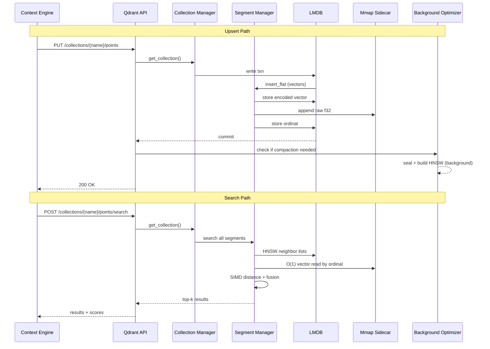

# Helion — Architecture

## System Overview

```mermaid
graph TB
    subgraph Clients
        CE[Context Engine<br/>Python Backend]
        EXT[VS Code Extension]
        MIG[Migration Script]
    end

    subgraph "Helix Gateway (HTTP)"
        direction TB
        QDRANT_API["Qdrant-Compatible API<br/>:6969 (container) / :6333 (Service)<br/>collections · points · search<br/>scroll · query · index · aliases"]
        GRAPH_API["Graph API<br/>/v1/graph/*<br/>callers · callees · pagerank<br/>communities · subgraph · impact"]
        INGEST_API["Ingest API<br/>/v1/ingest/*<br/>NDJSON streaming · edges"]
        HEALTH["Health / Ready<br/>Raft Internal"]
    end

    subgraph "Helix Engine"
        direction TB
        subgraph "Vector Core"
            HNSW["HNSW Index<br/>parallel bulk build<br/>split-phase (PreparedIndex)"]
            MMAP["Mmap Sidecar<br/>O(1) vector reads<br/>flat .hvec files"]
            SEGMENTS["Segment Manager<br/>Mutable → Building → Indexed<br/>bounded merge (≤4 segments)"]
            SPINDLE["Spindle Compression<br/>TurboQuant · ScalarInt8<br/>BinarySign"]
            SPARSE["Sparse Vectors<br/>inverted index · IDF<br/>WAND early termination"]
            SIMD["SIMD Distance<br/>NEON (arm64)<br/>AVX2 (x86_64)"]
            OPTIMIZER["Background Optimizer<br/>seal · build · merge<br/>async per-collection"]
        end

        subgraph "Graph Core"
            BFS["BFS Traversal<br/>forward · reverse · impact"]
            ALGO["Graph Algorithms<br/>PageRank · communities<br/>shortest path · Jaccard"]
            CYCLES["Cycle Detection"]
        end

        subgraph "Storage Core"
            CM["Collection Manager<br/>LRU cache (256 max)<br/>lazy open · auto-heal"]
            STORAGE["HelixGraphStorage<br/>per-collection LMDB env"]
            WAL["WAL<br/>CRC32C · 64MB segments<br/>flush on shutdown"]
            REPL["Raft Replication<br/>3-node consensus<br/>shared secret auth"]
            META["Metadata<br/>payload indices<br/>storage stats"]
        end
    end

    subgraph "LMDB Storage (per collection)"
        direction LR
        NODES_DB["nodes_db<br/>node ID → serialized node"]
        EDGES_DB["edges_db<br/>edge ID → serialized edge"]
        ADJ_DB["out/in_edges_db<br/>adjacency lists<br/>(DUP_SORT)"]
        VEC_DB["vectors_db<br/>encoded vectors<br/>(spindle or raw)"]
        HNSW_DB["hnsw_neighbors_db<br/>packed adjacency<br/>+ approx codes"]
        ORD_DB["ordinals_db<br/>ID → mmap ordinal"]
        PAYLOAD_DB["payload_indices<br/>keyword · integer · float"]
    end

    subgraph "Disk"
        LMDB_FILES["LMDB data.mdb<br/>64MB initial<br/>grows to 8GB"]
        HVEC["*.hvec files<br/>flat mmap vectors<br/>zero-copy reads"]
        WAL_FILES["WAL segments<br/>append-only log"]
    end

    CE --> QDRANT_API
    CE --> GRAPH_API
    EXT --> CE
    MIG --> QDRANT_API

    QDRANT_API --> CM
    GRAPH_API --> CM
    INGEST_API --> CM
    HEALTH --> REPL

    CM --> STORAGE
    STORAGE --> HNSW
    STORAGE --> MMAP
    STORAGE --> SEGMENTS
    STORAGE --> BFS
    STORAGE --> ALGO
    STORAGE --> WAL
    STORAGE --> REPL

    SEGMENTS --> OPTIMIZER
    HNSW --> SIMD
    HNSW --> SPINDLE
    HNSW --> MMAP

    STORAGE --> NODES_DB
    STORAGE --> EDGES_DB
    STORAGE --> ADJ_DB
    STORAGE --> VEC_DB
    STORAGE --> HNSW_DB
    STORAGE --> ORD_DB
    STORAGE --> PAYLOAD_DB

    NODES_DB --> LMDB_FILES
    EDGES_DB --> LMDB_FILES
    ADJ_DB --> LMDB_FILES
    VEC_DB --> LMDB_FILES
    HNSW_DB --> LMDB_FILES
    ORD_DB --> LMDB_FILES
    MMAP --> HVEC
    WAL --> WAL_FILES

    style HNSW fill:#4a9eff,color:#fff
    style MMAP fill:#4a9eff,color:#fff
    style ALGO fill:#2ecc71,color:#fff
    style BFS fill:#2ecc71,color:#fff
    style LMDB_FILES fill:#e67e22,color:#fff
    style HVEC fill:#e67e22,color:#fff
```



Port note: the Qdrant-compatible REST API listens on `:6969` in the native helix-container runtime. `:6333` is the Kubernetes Service port exposed by the production deployment as a drop-in for CE's existing Qdrant client; the Service routes `6333 → 6969` on the container.

Scaling note: read availability and write throttling are tracked in
[read-write-isolation-plan.md](read-write-isolation-plan.md). The target
contract is that reads never queue behind writes or indexing, while accepted
writes remain durable and retryable when admission is saturated.

## Data Flow: Upsert + Search



## Module Map

```
helixdb/src/
  helix_engine/
    graph_core/
      config.rs          -- Config, VectorConfig, GraphConfig, RaftConfig
      graph_core.rs      -- HelixGraphEngine (global graph env)
      traversals/
        bfs.rs           -- bfs_forward, bfs_reverse, bfs_impact
        cycles.rs        -- detect_cycles
        algorithms.rs    -- pagerank, community detection (label propagation), shortest path (BFS), jaccard similarity, subgraph extraction
    storage_core/
      storage_core.rs    -- HelixGraphStorage (per-collection LMDB env)
      storage_methods.rs -- StorageMethods trait, BasicStorageMethods, DBMethods
      collection_manager.rs -- CollectionManager (lazy-open, aliases, snapshots)
      replication.rs     -- ReplicationManager, ReplicatedMutation, Raft runtime
      raft.rs            -- RaftNode, Proposal, AppliedProposal
      wal.rs             -- WalWriter, WalEntry, WalOp, recovery
      metadata.rs        -- StorageMetadata, PayloadIndexSchema, StorageStats
      filters.rs         -- Filter, FieldCondition, MatchCondition, RangeCondition
      upsert.rs          -- NodeUpsert, EdgeUpsert
      properties.rs      -- property serialization
    vector_core/
      mod.rs             -- submodule declarations
      vector_core.rs     -- VectorCore, HNSWConfig (per-index HNSW implementation)
      hnsw.rs            -- HNSW trait (search, insert, delete, public_score)
      vector.rs          -- HVector (id, data, distance, level)
      named_vectors.rs   -- NamedVectorManager, NamedVectorConfig, DistanceMetric; background optimizer thread, split-phase index build, per-collection indexing threshold
      segments.rs        -- MutableSegment (flat appendable) / IndexedSegment (HNSW); dense segment lifecycle (Mutable → Building → Indexed), LSM-style tiered compaction
      mmap_vectors.rs    -- mmap vector sidecar (flat mmap file alongside LMDB for O(1) f32 reads)
      spindle.rs         -- SpindleConfig, SpindleMode, encode/decode/score (TurboProd, ScalarInt8, BinarySign, TurboInt4)
      sparse.rs          -- SparseVector, SparseVectorCore, SparseVectorConfig, SparseModifier
      simd.rs            -- SIMD distance kernels (NEON/aarch64, AVX2/x86_64, scalar fallback); cosine, dot, euclid
      fusion.rs          -- rrf_fusion, RankedItem
    types.rs             -- GraphError, VectorError
  helix_gateway/
    gateway.rs           -- HelixGateway, GatewayOpts
    connection/
      connection.rs      -- ConnectionHandler (accept loop, signals, snapshots)
    router/
      router.rs          -- HelixRouter (exact + pattern routes), HandlerInput, HandlerFn
    thread_pool/
      thread_pool.rs     -- ThreadPool (flume channel, worker threads)
    api/
      register.rs        -- register_api_routes()
      health.rs          -- handle_health, handle_ready
      raft.rs            -- handle_status, handle_message, handle_propose
      collections.rs     -- handle_create, handle_drop, handle_list, handle_stats
      ingest.rs          -- handle_ingest_nodes, handle_ingest_edges, handle_ingest_stream
      graph.rs           -- graph traversal handlers (callers, callees, etc.)
      qdrant.rs          -- Qdrant-compatible REST handlers
  protocol/
    request.rs           -- Request, RequestHead
    response.rs          -- Response
    value.rs             -- Value enum
    items.rs             -- Node, Edge, SerializedNode, SerializedEdge
    deterministic_id.rs  -- node_id(), edge_id() (XxHash64-based u128)
    filterable.rs        -- Filterable trait

helix-container/src/
  main.rs                -- Server entrypoint
  queries/               -- Compiled HelixQL handlers (inventory)
```

---

## Storage Layer

### Two-tier LMDB design

1. **Global graph engine** (`HelixGraphEngine`): a single LMDB env at `{data_dir}/`. Used for compiled HelixQL route handlers.

2. **Per-collection storage** (`HelixGraphStorage`): each collection gets its own LMDB env at `{data_dir}/collections/{name}/`. Managed by `CollectionManager`.

### HelixGraphStorage

Struct defined in `storage_core.rs`. Each instance holds:

- `graph_env: Env<WithTls>` -- the LMDB environment
- `nodes_db: Database<U128<BE>, Bytes>` -- node storage
- `edges_db: Database<U128<BE>, Bytes>` -- edge storage
- `out_edges_db: Database<Bytes, Bytes>` -- outgoing edge index (compound keys)
- `in_edges_db: Database<Bytes, Bytes>` -- incoming edge index (compound keys)
- `metadata_db: Database<Str, Bytes>` -- storage metadata
- `secondary_indices: HashMap<String, Database<Bytes, Bytes>>` -- property secondary indices
- `multi_indices: HashMap<String, Database<Bytes, Bytes>>` -- 1:N DUP_SORT indices
- `payload_indices: RwLock<HashMap<String, PayloadIndexHandle>>` -- payload field indices
- `vectors: VectorCore` -- default (unnamed) HNSW index
- `named_vectors: NamedVectorManager` -- named vector indexes (dense + sparse)
- `wal: WalWriter` -- write-ahead log

### CollectionManager

Defined in `collection_manager.rs`. Lazy-opens collections on first access with an LRU cache. Key behaviors:

- `get_collection(name)` resolves aliases first, then checks in-memory LRU cache, then opens from disk.
- `create_collection(name)` creates directory and LMDB env.
- `drop_collection(name)` removes from cache, deletes directory, cleans up stale aliases.
- Aliases are persisted to `{data_dir}/aliases.json`.
- LRU cache capacity: `HELIX_MAX_OPEN_COLLECTIONS` (default 256). When full, 25% of idle collections are batch-evicted (~2 ms reopen cost).
- Corrupted LMDB envs are auto-evicted and re-opened from disk (auto-heal).
- `max_dbs`: 65536 per env by default, `max_readers`: 2048 per env.

### StorageMetadata

Persisted in the `metadata` database under key `"current"`. Contains:

- `schema_version: u32` (current: 2)
- `created_at_millis`, `updated_at_millis`
- `secondary_indices: Vec<String>`
- `payload_indices: HashMap<String, PayloadIndexSchema>`
- `named_vectors: HashMap<String, NamedVectorConfig>`
- `sparse_vectors: HashMap<String, SparseVectorConfig>`
- `stats: StorageStats` (node_count, edge_count, vector_count)

---

## Vector Engine

### HNSW

The `HNSW` trait (`hnsw.rs`) defines the core interface:

```rust
fn search<F>(&self, txn: &RoTxn, query: &[f32], k: usize,
             filter: Option<&[F]>, should_trickle: bool) -> Result<Vec<HVector>, VectorError>
    where F: Fn(&HVector) -> bool;
fn insert(&self, txn: &mut RwTxn, vector: &HVector) -> Result<(), VectorError>;
fn delete_vector(&self, txn: &mut RwTxn, id: u128) -> Result<(), VectorError>;
fn public_score(&self, internal_distance: f32) -> f32;
```

Implemented by `VectorCore` (`vector_core.rs`).

### VectorCore

Each `VectorCore` instance manages:

- LMDB databases: `vectors_{name}` (HNSW graph edges), `vector_data_{name}` (vector storage/metadata)
- `HNSWConfig`: m, m_max_0 (2*m), ef_construct, m_l (1/ln(m)), ef
- `DistanceMetric`: Cosine, Dot, Euclid
- `SpindleConfig`: compression settings

Vectors are stored as `HVector` (id: u128, data: Vec<f32>, distance: Option<f32>, level: usize).

Each vector can optionally store the original f32 vector in `StoredVectorData` alongside arbitrary `fields: HashMap<String, Value>`.

Distance computation uses SIMD-accelerated kernels (`simd.rs`): NEON on aarch64, AVX2 on x86_64, scalar fallback elsewhere. All three metrics (cosine, dot, euclid) supported. f64 accumulators for precision, f32 result.

**Mmap sidecar** (`mmap_vectors.rs`): a flat mmap file stored alongside the LMDB env. Provides O(1) f32 vector reads without LMDB transaction overhead. Used during HNSW search for raw vector access during rescore.

**PreparedIndex / split-phase build**: HNSW construction happens entirely outside the write transaction. Vectors are extracted under a read lock (`RoTxn`), the index is built without holding any lock, then the result is committed under a short write lock (`RwTxn`). This avoids blocking concurrent upserts during index builds.

**Background optimizer thread**: seal/build/merge operations run asynchronously. The write path (upsert) returns immediately after appending to the mutable tail. The optimizer seals full tail segments, builds HNSW, and merges segments when the count exceeds the cap — all without blocking ingest.

### NamedVectorManager

Defined in `named_vectors.rs`. Manages multiple named dense vector spaces and sparse vector spaces within a single LMDB environment.

#### Dense Segment Lifecycle

Each dense vector space uses a **bounded multi-segment architecture**:

- **Mutable tail segment**: Flat (unindexed) buffer that receives all new inserts. When it reaches `flat_scan_threshold` (default 4,096) vectors, it is finalized into an indexed segment.
- **Indexed segments**: Immutable HNSW-indexed segments. Search fans out across all indexed segments plus the mutable tail. The target indexed fanout is controlled by `HELIX_DENSE_MAX_INDEXED_SEGMENTS` (default 16) before background compaction merges kick in.
- **Split-phase build**: HNSW construction happens outside the write transaction. Vectors are extracted under a read lock, the index is built without holding any lock, then the result is committed under a write lock. This avoids blocking concurrent upserts.
- **No post-convergence merge-to-one**: After ingest quiesces, segments are NOT merged into a single HNSW graph. Only empty segments are cleaned up. This eliminates the O(n²) rebuild that was the dominant ingest bottleneck for large collections.

Key dense methods:
- `dense_insert(env, txn, name, id, vector, hnsw_config)` -- insert into mutable tail, auto-finalize if threshold reached
- `finalize_dense_tail(env, txn, name, hnsw_config)` -- seal tail into indexed segment via split-phase build
- `build_dense_segment(env, txn, name, seg_id, hnsw_config)` -- build HNSW index for a segment (split-phase)
- `maybe_merge_dense_segments(env, txn, name, hnsw_config, max_segments)` -- merge two smallest segments when above cap
- `cleanup_empty_dense_segments(txn, name)` -- remove segments with zero vectors
- `dense_search(txn, name, query, k, filter)` -- fan-out search across all segments

Also manages sparse vector spaces via `SparseVectorCore` instances.

Key sparse/general methods:
- `create_vector_index(env, txn, name, config, hnsw_config)` -- create a new dense vector space
- `create_sparse_index(env, txn, name, config)` -- create a new sparse index
- `with_sparse_core(name, closure)` -- execute with read-locked access to a `SparseVectorCore`
- `delete_vector(txn, id)` -- remove from all dense indexes
- `delete_sparse_vectors(txn, id)` -- remove from all sparse indexes

### Spindle (Vector Compression)

Source: `spindle.rs`. The Spindle subsystem provides vector compression with multiple modes:

| Mode | Enum | Bits/dim | Compression | Notes |
|---|---|---|---|---|
| None | `SpindleMode::None` | 32 | 1x | Raw f32 storage |
| Scalar Int8 | `SpindleMode::ScalarInt8` | 8 | ~8x | 127-level uniform quantization, near-lossless |
| Binary Sign | `SpindleMode::BinarySign` | 1 | ~54x at 768d | Sign-bit only, low quality |
| Turbo Int4 | `SpindleMode::TurboInt4` | 4 | ~12x | Rotated Lloyd-Max codebook |
| TurboProd | `SpindleMode::TurboProd` | 4 | ~15x | 3-bit MSE + 1-bit QJL residual (arXiv:2504.19874). Unbiased inner product estimation |

`SpindleConfig` fields:

| Field | Type | Default |
|---|---|---|
| `mode` | SpindleMode | `TurboProd` (in struct Default) / `None` (when Qdrant quantization omitted) |
| `keep_original` | bool | true |
| `rescore` | bool | true |
| `oversampling` | usize | 16 |
| `binary_dims` | usize | 256 |
| `turbo_dims` | usize | 768 |

When `keep_original` is true, HelixDB keeps an exact f32 original available for rescoring. For mmap-backed named vectors, the exact original is retained once in the HVEC sidecar and LMDB stores only payload fields; LMDB stores a duplicate original only when no exact sidecar is available. When `rescore` is true, `oversampling` is the rerank quality cap: small top-k requests keep the full cap, larger unfiltered requests use a smaller adaptive candidate pool, and selective filtered requests boost back toward the cap. The shortlisted candidates are rescored against the exact original when available. Merge/export paths prefer stored originals, then sidecar vectors, then decoded compressed vectors so segment maintenance does not unnecessarily rebuild from lossy payloads.

The optional HVS8 sidecar format is lossy SQ8 and is only used when exact originals are not required. Segments with `keep_original=true` skip HVS8 conversion so exact rerank does not silently degrade.

Core functions: `encode_vector`, `decode_vector`, `prepare_query`, `project_for_search`, `score_encoded`.

Constants: `TURBO_BITS=4`, `TURBO_LEVELS=16`, `MSE_BITS=3`, `MSE_LEVELS=8`, segment magic `SPN1`.

### Sparse Vectors

Source: `sparse.rs`. Inverted-index based sparse vector search.

`SparseVector` wire format: parallel `indices: Vec<u32>` and `values: Vec<f32>`. Validated for equal length, no duplicate indices, all finite values.

`SparseVectorConfig`:
- `full_scan_threshold: usize` (default 5000) -- term count threshold before switching to index-based lookup
- `modifier: SparseModifier` -- `None` or `Idf` (TF-IDF weighting at query time)

`SparseVectorCore` stores data in LMDB databases:
- `sparse_{name}_postings` -- inverted posting lists (term -> doc IDs + weights)
- `sparse_{name}_meta` -- per-document metadata

Search returns `Vec<(u128, f64)>` (doc ID, score) using a min-heap with deterministic tie-breaking. Supports WAND early termination when `wand_enabled` and >= 3 query terms.

### Fusion

Source: `fusion.rs`. Reciprocal Rank Fusion (RRF) combines multiple ranked lists.

```
score(doc) = sum( 1 / (k + rank_in_list) )  for each list containing doc
```

k = 60 (Cormack, Clarke, Buettcher 2009). Used in the `query_points` endpoint to fuse prefetch results from multiple vector spaces.

---

## Graph Engine

### HelixGraphEngine

Global graph engine (`graph_core.rs`). Creates a single LMDB environment with the standard database set. Used by compiled HelixQL handlers registered via the `inventory` crate.

### Graph Traversals

BFS-based traversals in `helix_engine/graph_core/traversals/`:

- `bfs_forward(storage, txn, start_ids, edge_types, depth, limit)` -- follow outgoing edges
- `bfs_reverse(storage, txn, start_ids, edge_types, depth, limit)` -- follow incoming edges
- `bfs_impact(storage, txn, start_ids, depth, limit)` -- bidirectional impact analysis
- `detect_cycles(storage, txn, start_id, edge_types, limit)` -- DFS-based cycle detection

Results are `Vec<BfsResult>` where `BfsResult` contains the `Node` and traversal `depth`.

### Graph Algorithms

Higher-level algorithms in `helix_engine/graph_core/traversals/algorithms.rs`:

- `pagerank(storage, txn, edge_labels, iterations, damping)` -- iterative power method, returns `Vec<(u128, f64)>` ranked by score
- `label_propagation(storage, txn, edge_labels, iterations)` -- community detection, returns communities grouped as `Vec<(community_id, Vec<node_id>)>`
- `shortest_path(storage, txn, from_id, to_id, edge_labels, max_depth, max_visited)` -- budgeted BFS shortest path, returns ordered path nodes and distance
- `jaccard_similarity(storage, txn, node_a, node_b, edge_labels)` -- Jaccard similarity between two nodes' neighbor sets, returns `f64`
- `subgraph(storage, txn, node_ids, edge_labels)` -- extract node + edge subgraph for visualization

All exposed via `POST /v1/graph/*` HTTP endpoints (pagerank, communities, shortest_path, jaccard, subgraph, delete_by_path).

### Deterministic IDs

Node and edge IDs are deterministic u128 values derived from content via double-XxHash64 (`deterministic_id.rs`):

- `node_id(collection, label, name, path)` -- hashes the tuple to u128
- `edge_id(collection, edge_type, from_name, to_name, from_path, to_path)` -- hashes the tuple to u128

This makes upserts idempotent: reinserting the same entity overwrites rather than duplicates.

---

## Gateway and Request Flow

### Architecture

```
TCP listener (tokio)
  |
  v
ConnectionHandler::accept_conns()    -- tokio::select! over accept/signals/snapshots
  |
  v
ThreadPool (flume channel)           -- N worker threads (default 1024)
  |
  v
HelixRouter::dispatch()              -- match (method, path) to HandlerFn
  |
  v
Handler function                     -- receives HandlerInput, writes to Response
```

### HelixRouter

Supports two route types:
1. **Exact routes**: `HashMap<(method, path), HandlerFn>` -- O(1) lookup
2. **Pattern routes**: `Vec<(method, pattern, HandlerFn)>` -- linear scan with `{param}` extraction

Pattern routes extract path parameters into `HandlerInput.path_params` (e.g. `{name}` -> `"my_collection"`).

### HandlerInput

Every handler receives:

```rust
pub struct HandlerInput {
    pub request: Request,            // method, path, headers, body
    pub graph: Arc<HelixGraphEngine>,
    pub collections: Arc<CollectionManager>,
    pub replication: Arc<ReplicationManager>,
    pub path_params: HashMap<String, String>,
}
```

### Thread pool

Workers read `TcpStream` from a flume channel. Each worker owns cloned `Arc` references to the graph engine, collection manager, replication manager, and router.

---

## Replication

### ReplicationManager

Source: `replication.rs`. Central mutation coordinator.

When Raft is disabled (default), mutations apply directly to `CollectionManager`.

When Raft is enabled:
1. `apply(mutation)` serializes the `ReplicatedMutation` and proposes it to the Raft leader.
2. If this node is not the leader, the proposal is forwarded via HTTP to `/_raft/propose` on the leader.
3. The Raft consensus loop commits the entry and applies it to all nodes.
4. Applied proposals call back through `CollectionManager` to execute the actual storage mutation.

### ReplicatedMutation variants

```rust
enum ReplicatedMutation {
    CreateCollection { name, vectors, sparse_vectors },
    DeleteCollection { name },
    UpsertPoints { collection, points: Vec<ReplicatedPoint> },
    DeletePoints { collection, ids: Vec<u128> },
    CreatePayloadIndex { collection, field_name, schema },
    IngestBatch { collection, ops: Vec<ReplicatedIngestOp> },
    UpdateCollection { name, vectors, sparse_vectors },
}
```

### ReplicatedPoint

```rust
struct ReplicatedPoint {
    id: u128,
    vectors: HashMap<String, Vec<f32>>,      // dense vectors
    sparse_vectors: HashMap<String, SparseVector>,  // sparse vectors
    payload: HashMap<String, Value>,          // metadata
}
```

### Transport

Inter-node communication uses `HttpRaftTransport` (reqwest blocking client, 5s timeout). Messages are protobuf-encoded (`raft::prelude::Message`). Proposals are bincode-encoded `ReplicatedMutation`.

When Raft is disabled, a `NoopRaftTransport` is used to avoid constructing a reqwest client (which owns an internal tokio Runtime and cannot be dropped in async context).

---

## Data Flow

### Upsert (Qdrant-compatible)

```
PUT /collections/{name}/points
  |
  v
handle_upsert_points() -- parse PointInput[], split dense/sparse vectors
  |
  v
ReplicationManager::apply(UpsertPoints { collection, points })
  |
  v  (if Raft enabled: propose -> consensus -> apply on all nodes)
  |  (if Raft disabled: apply directly)
  v
CollectionManager::get_or_create_collection(name)
  |
  v
For each ReplicatedPoint:
  1. Upsert node (id, label="", properties=payload) into nodes_db
  2. For each dense vector (name, data):
     - NamedVectorManager::dense_insert() -> appends to mutable tail segment
     - If tail reaches flat_scan_threshold (4096): auto-finalize via split-phase build
       (extract vectors read-only, build HNSW outside lock, commit under write lock)
     - If Spindle enabled: encode_vector() stores compressed form
     - If keep_original: store original f32 in StoredVectorData
  3. For each sparse vector (name, SparseVector):
     - NamedVectorManager::with_sparse_core(name) -> SparseVectorCore::upsert()
     - Posting lists updated per term index
  4. Update payload indices for indexed fields
  5. Increment metadata counters
  6. Post-batch optimizer: finalize any remaining tail, merge if above `HELIX_DENSE_MAX_INDEXED_SEGMENTS` (default 16)
```

### Search (dense)

```
POST /collections/{name}/points/search
  |
  v
handle_search_points() -- parse SearchRequest
  |
  v
Get storage via CollectionManager::get_collection(name)
  |
  v
Open read transaction (graph_env.read_txn())
  |
  v
If filter present:
  1. indexed_filter_candidates() -- resolve indexed fields to candidate ID sets
  2. Build filter_fn closure that checks candidates + payload match
  |
  v
NamedVectorManager::dense_search(txn, vec_name, query, limit, filter)
  |
  v
Multi-segment fan-out:
  1. Search each indexed segment's HNSW graph in parallel
  2. Search the mutable tail segment via flat scan
  3. Merge results by score, deduplicate by ID, take top-k
  |
Per-segment HNSW search:
  1. Enter at entry point, descend to layer 0
  2. Greedy search with ef candidates
  3. Filter applied DURING traversal (not post-filter)
  4. If Spindle enabled: score_encoded() for initial ranking
  5. If rescore: re-rank shortlist against original vectors
  |
  v
Truncate to limit, convert to public scores via core.public_score()
  |
  v
For each result: load node from nodes_db, emit {id, score, payload}
```

### Search (sparse)

```
POST /collections/{name}/points/query  (with sparse query)
  |
  v
SparseVectorCore::search(txn, sparse_vec, limit, filter_fn)
  |
  v
For each query term index:
  1. Look up posting list from LMDB
  2. Accumulate dot-product scores per document
  3. If modifier=Idf: apply IDF weighting
  |
  v
Min-heap top-k selection, return Vec<(u128, f64)>
```

### Delete

```
POST /collections/{name}/points/delete
  |
  v
If by IDs:
  ReplicationManager::apply(DeletePoints { collection, ids })
    -> delete from nodes_db
    -> NamedVectorManager::delete_vector(txn, id)  -- all dense indexes
    -> NamedVectorManager::delete_sparse_vectors(txn, id)  -- all sparse indexes
    -> remove from payload indices
    -> decrement metadata counters

If by filter:
  1. Open read txn, scan nodes matching filter
  2. Collect matching IDs
  3. Apply DeletePoints with collected IDs
```

### Ingest (graph)

```
POST /v1/ingest/nodes
  |
  v
For each NodeInput:
  1. Compute deterministic node ID from (collection, label, name, path)
  2. Build NodeUpsert with merged properties
  3. Wrap in ReplicatedIngestOp::Node
  |
  v
ReplicationManager::apply(IngestBatch { collection, ops })
  -> CollectionManager::get_or_create_collection()
  -> Upsert each node into nodes_db
  -> Update metadata counters
```

Edge ingest follows the same pattern with `EdgeUpsert`, creating entries in `out_edges_db` and `in_edges_db`.
